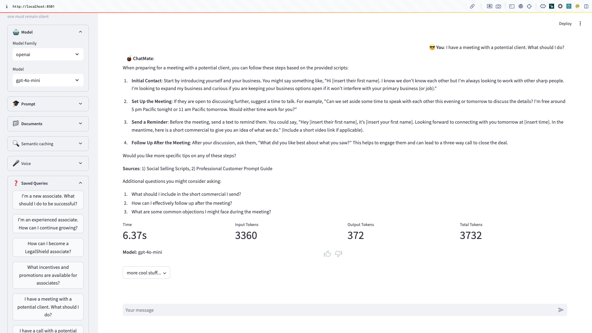

# ChatMate

**ChatMate** is a versatile chatbot sandbox client that can interact with multiple models
and provides useful information about the models responses.

### Key Features:
1. **Chose your AI Model**: ChatMate supports for multiple AI models from Anthropic, Google,
 OpenAI, Meta (through Groq), etc. Additional models can be easily configured.
1. **Saved Queries**: Save commonly used queries to quickly run them without typing them every time.
1. **Edit your System Prompt**: Tweak your system prompt to improve model responses.



### Installing Locally

1. **Install Python**: Make sure you have Python installed on your machine. You can download Python from the [official website](https://www.python.org/).

1. **Clone repository**:
    ```bash
    git clone git@github.com:feder1402/chatmate.git
    ``` 
1. **Access your local repository**
    ```bash
    cd chatmate
    ```

1. **Set Up a Virtual Environment (optional)**: It is recommended to create a virtual environment for your project.
   ```bash
   python3 -m venv env
   source env/bin/activate  # On Windows, use `env\Scripts\activate`
   ```

1. **Install dependencies**
    ```bash
    pip install -r requirements.txt
    ```

1. **Configure API Keys**: Using `env.example` as a template, create a `.env` file and provide your own API Keys for any model you plan to use.
   ```md
   # API Keys
   OPENAI_API_KEY="Your OpenAI API key"
   ANTHROPIC_API_KEY="Your Anthropic API key"
   GOOGLE_API_KEY="Your Google Gemini API key"
   GROQ_API_KEY="Your GROQ Api Key"

   # Tracing options (Optional)
   LANGCHAIN_TRACING_V2="true" # true enables tracing to LangSmith
   LANGCHAIN_API_KEY="Your LangSmith API key" # Only needed if tracing is enabled
   LANGCHAIN_PROJECT="Name of the LanhSmith project to send traces to" # Only needed if tracing is enabled
   ```

1. **Configure Chat Options**: Use `config.toml` to configure the system prompt you want to use, list of saved queries, and models to try.

1. **Run the Streamlit App**: Navigate to your project directory and run the app using Streamlit.
   ```bash
   streamlit run streamlit_app.py
   ```
1. **Access the App**: Once the app is running, it will be accessible in your browser at `http://localhost:8501`.

## Feedback and Contribution

If you have suggestions or want to contribute to improving ChatMate, please feel free to open issues or submit pull requests in the repository. User feedback is valuable for enhancing the functionality and user experience of the application.

## Credits
ChatkMate was made with [Streamlit](https://streamlit.io/) and [LangChain](https://python.langchain.com).